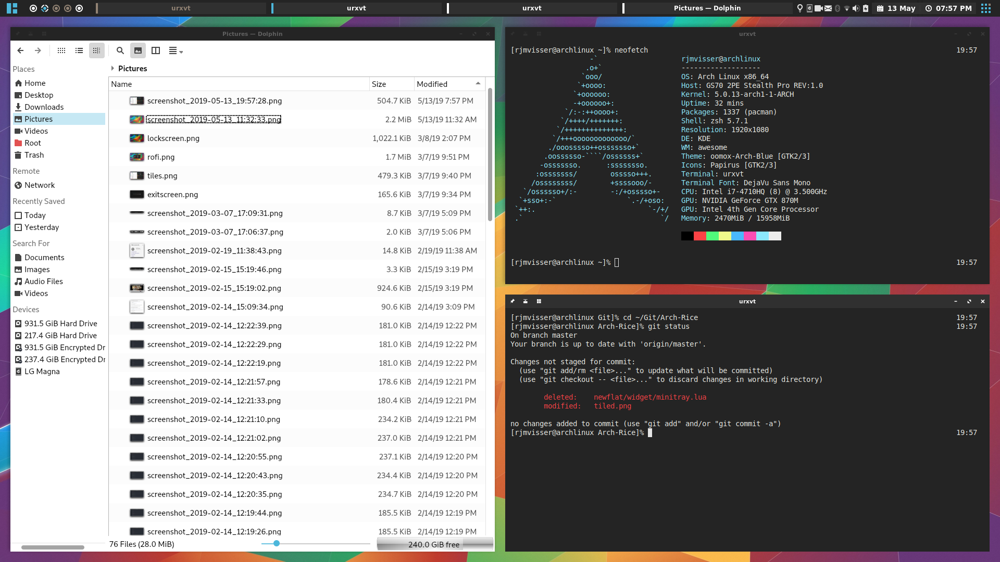
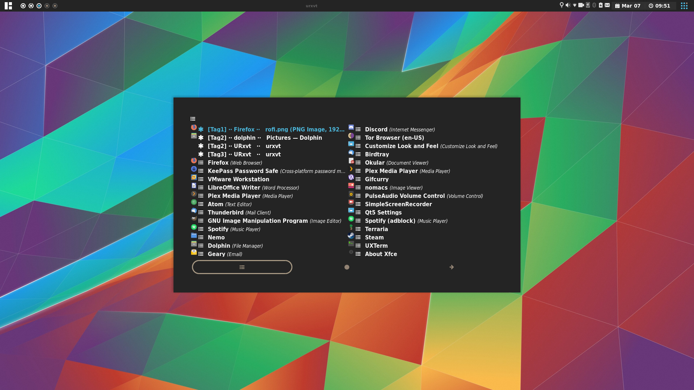
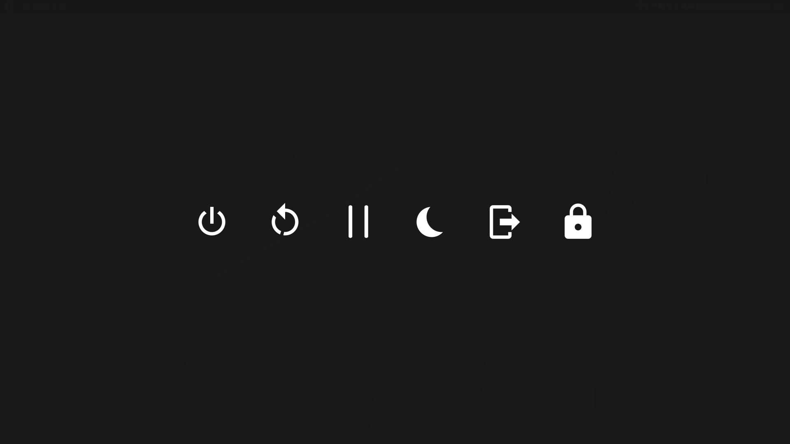

Personal AwesomeWM config and Rice
==================================


| Tiled         | Rofi         | Exit screen   |
|:-------------:|:-------------:|:-------------:|
||||
    
Table of contents
=================
<!--ts-->
   * [Intro](#personal-awesomewm-config-and-rice)
   * [Table of contents](#table-of-contents)
   * [Grub2 Theme](https://github.com/RJMVisser/Arch-Grub2)
   * [Locate pointer](https://github.com/RJMVisser/Locate-pointer)
   * [Top pannel](#top-pannel)
      * [Trays](#trays)
   * [AUR Helper](#aur-helper)
   * [Lockscreen](#lockscreen)
   * [Dolphin icons missing](#dolphin-icons-missing)
   * [Multiple keyboard layouts](#multiple-keyboard-layouts)
<!--te-->

## Installation

### 1) Get all the dependencies
- [AwesomeWM](https://awesomewm.org/) as the window manager
- [Compton](https://github.com/yshui/compton) X compositor that may fix tearing issues
- [ttf-dejavu](https://dejavu-fonts.github.io/) as the **font**
- [nerd-fonts-complete](https://github.com/ryanoasis/nerd-fonts) as secondary font
- [Rofi](https://github.com/DaveDavenport/rofi) for the app launcher
- (Optional) [lxappearance](https://sourceforge.net/projects/lxde/files/LXAppearance/) to set up the gtk and icon theme
- (Optional) [bibata-cursor-theme](https://github.com/KaizIqbal/Bibata_Cursor) as mouse theme
- (Optional) [papirus-icon-theme](https://github.com/PapirusDevelopmentTeam/papirus-icon-theme) as icon theme

### 2) Clone the configuration

```
git clone https://github.com/RJMVisser/Arch-Rice.git 
cd Arch-Rice
cp -R .config/awesome ~/.config/awesome
```

### 3) Set the themes
Start **lxappearance** to active the **icon** theme, **GTK** theme and **mouse** theme

Shell
========

```
git clone https://github.com/RJMVisser/Arch-Rice.git 
cd Arch-Rice
cp .zshrc ~/.zshrc
cp .Xresources ~/.Xresources
```

| Packages |Discription|
|---|---|
|[zsh](https://www.zsh.org/)|A very advanced and programmable command interpreter (shell) for UNIX|
|[zsh-autosuggestions](https://github.com/zsh-users/zsh-autosuggestions)|Fish-like autosuggestions for zsh|
|[zsh-syntax-highlighting](https://github.com/zsh-users/zsh-syntax-highlighting)|Fish shell like syntax highlighting for Zsh|


Terminal drawing
=================


> Location: .config/awesome/color/scripts/draw.sh

| Packages |Discription|
|---|---|
|[slop](https://github.com/naelstrof/slop)|Utility to query the user for a selection and print the region to stdout|
|[rxvt-unicode-pixbuf](http://software.schmorp.de/pkg/rxvt-unicode.html)|Unicode enabled rxvt-clone terminal emulator (urxvt), with support for custom icons and backgrounds|


Terminal increase font
======================


> location /usr/lib/urxvt/perl/font-size


Top Pannel
==========


<p align="center">
 Layout indicator
&nbsp;&nbsp;&nbsp;&nbsp;&nbsp;
 Workspace indicator
&nbsp;&nbsp;&nbsp;&nbsp;&nbsp;
 Trays
&nbsp;&nbsp;&nbsp;&nbsp;&nbsp;
 Tray counter and show/hide button for trays 
</p>


Trays
-----

| Packages |Discription|
|---|---|
|[birdtray](https://github.com/gyunaev/birdtray)|Thunderbird with a system tray icon.|
|[kdeconnect](https://community.kde.org/KDEConnect)|Adds communication between KDE and your smartphone.|
|[simplescreenrecorder](http://www.maartenbaert.be/simplescreenrecorder/)|A feature-rich screen recorder that supports X11 and OpenGL.|
|[xfce4-power-manager](https://goodies.xfce.org/projects/applications/xfce4-power-manager)|Power manager for Xfce desktop.|
|[redshift](http://jonls.dk/redshift/)|Adjusts the color temperature of your screen according to your surroundings.|
|[network-manager-applet](https://wiki.gnome.org/Projects/NetworkManager/)|Applet for managing network connections.|
|[blueman](https://github.com/blueman-project/blueman)|GTK+ Bluetooth Manager.|
|[pa-applet-git](https://github.com/fernandotcl/pa-applet)|PulseAudio control applet.|


AUR Helper
==========
[**Y**et **A**nother **Y**ogurt](https://github.com/Jguer/yay) - An AUR Helper Written in Go
```
git clone https://aur.archlinux.org/yay.git
cd yay
makepkg -si
```
> yay does its job, but [aurutils](https://github.com/AladW/aurutils) gives you absolute control over everything and more flexibility.


Lockscreen
==========
[i3lock-fancy](https://github.com/meskarune/i3lock-fancy) is an i3lock bash script that takes a screenshot of the desktop, blurs the background and adds a lock icon and text.
```
sudo yay -Sy i3lock-color-git i3lock-fancy-dualmonitors-git
```

Dolphin terminal
================


Dolphin icons missing
=====================
Unlike Qt4, Qt5 does not ship a qtconfig utility to configure fonts, icons or styles. Instead, it will try to use the settings from the running desktop environment. In KDE Plasma or GNOME this works well, but in other less popular desktop environments or window managers it can lead to missing icons in Qt5 applications.
```
sudo pacman -Sy qt5-styleplugins  
echo 'QT_QPA_PLATFORMTHEME=gtk2' | sudo tee --append /etc/enviroment
```
> Another solution is provided by the qt5ct package, which provides a Qt5 QPA independent of the desktop environment and a configuration utility. After installing the package, run qt5ct to set an icon theme, and set the environment variable Q\_QPA\_PLATFORMTHEME="qt5ct" so that the settings are picked up by Qt applications. Alternatively, use --platformtheme qt5ct as argument to the Qt5 application. 


Multiple keyboard layouts
=========================
Add the following to your profile:
```
setxkbmap -layout us,ru
setxkbmap -option 'grp:shift_caps_toggle'
```
>> ┌───────────────────────────────────────────────────────────────────────────────────────────────────────────┐
   │Option                      Description                                                                    │
   ├───────────────────────────────────────────────────────────────────────────────────────────────────────────┤
   │grp:switch                  Right Alt (while pressed)                                                      │
   │grp:lswitch                 Left Alt (while pressed)                                                       │
   │grp:lwin\_switch             Left Win (while pressed)                                                       │
   │grp:rwin\_switch             Right Win (while pressed)                                                      │
   │grp:win\_switch              Any Win key (while pressed)                                                    │
   │grp:caps\_switch             Caps Lock (while pressed), Alt+Caps Lock does the original capslock action     │
   │grp:rctrl\_switch            Right Ctrl (while pressed)                                                     │
   │grp:toggle                  Right Alt                                                                      │
   │grp:lalt\_toggle             Left Alt                                                                       │
   │grp:caps\_toggle             Caps Lock                                                                      │
   │grp:shift\_caps\_toggle       Shift+Caps Lock                                                                │
   │grp:shift\_caps\_switch       Caps Lock (to first layout), Shift+Caps Lock (to last layout)                  │
   │grp:win\_menu\_switch         Left Win (to first layout), Right Win/Menu (to last layout)                    │
   │grp:lctrl\_rctrl\_switch      Left Ctrl (to first layout), Right Ctrl (to last layout)                       │
   │grp:alt\_caps\_toggle         Alt+Caps Lock                                                                  │
   │grp:shifts\_toggle           Both Shift keys together                                                       │
   │grp:alts\_toggle             Both Alt keys together                                                         │
   │grp:ctrls\_toggle            Both Ctrl keys together                                                        │
   │grp:ctrl\_shift\_toggle       Ctrl+Shift                                                                     │
   │grp:lctrl\_lshift\_toggle     Left Ctrl+Left Shift                                                           │
   │grp:rctrl\_rshift\_toggle     Right Ctrl+Right Shift                                                         │
   │grp:ctrl\_alt\_toggle         Alt+Ctrl                                                                       │
   │grp:alt\_shift\_toggle        Alt+Shift                                                                      │
   │grp:lalt\_lshift\_toggle      Left Alt+Left Shift                                                            │
   │grp:alt\_space\_toggle        Alt+Space                                                                      │
   │grp:menu\_toggle             Menu                                                                           │
   │grp:lwin\_toggle             Left Win                                                                       │
   │grp:rwin\_toggle             Right Win                                                                      │
   │grp:lshift\_toggle           Left Shift                                                                     │
   │grp:rshift\_toggle           Right Shift                                                                    │
   │grp:lctrl\_toggle            Left Ctrl                                                                      │
   │grp:rctrl\_toggle            Right Ctrl                                                                     │
   │grp:sclk\_toggle             Scroll Lock                                                                    │
   │grp:lctrl\_lwin\_rctrl\_menu   LeftCtrl+LeftWin (to first layout), RightCtrl+Menu (to second layout)          │
   │                                                                                                           │
   └───────────────────────────────────────────────────────────────────────────────────────────────────────────┘

To Do
=====
- [ ] Fix incomplete hotkeys in main hotkeys helper
- [ ] Add hotkey to move window to other monitor
